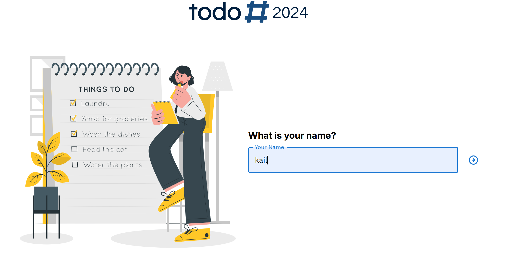
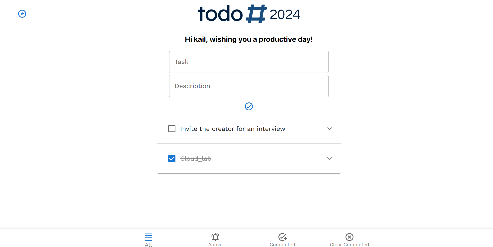

  
  <h1>ToDo App</h1>

___

### Instalation:

##### `git clone https://github.com/piotrGrigoret/toDo2024.git`
##### `npm i`
##### `npm run start`

#### The application is available online at this url

##### https://todo2024.onrender.com/
___

### Description:

This application is a simple and convenient to-do list designed to help users organize their daily tasks. Users can enter their name and receive a personalized greeting, adding a welcoming touch. The app features a minimalist and stylish interface, allowing users to add task titles and descriptions. It also includes filters to display active and completed tasks, as well as a function to clear completed tasks, helping users keep their task list organized.

Notably, the application is fully responsive and works well on mobile devices, ensuring a smooth experience on different screen sizes. This app is purely a frontend solution — all data is stored locally on the user's device and is not saved in a database, ensuring information is retained only as long as the app remains open or until the page is refreshed.

<<<<<<< HEAD

=======
>>>>>>> fafde5366d0a8b301fd9359f4257623ddc1c2a7e
